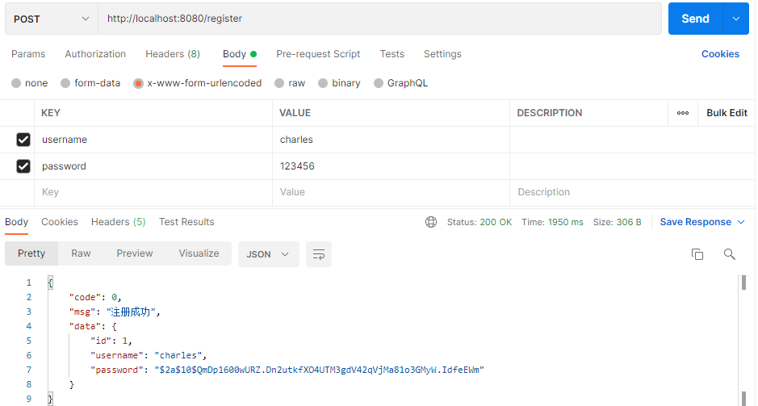
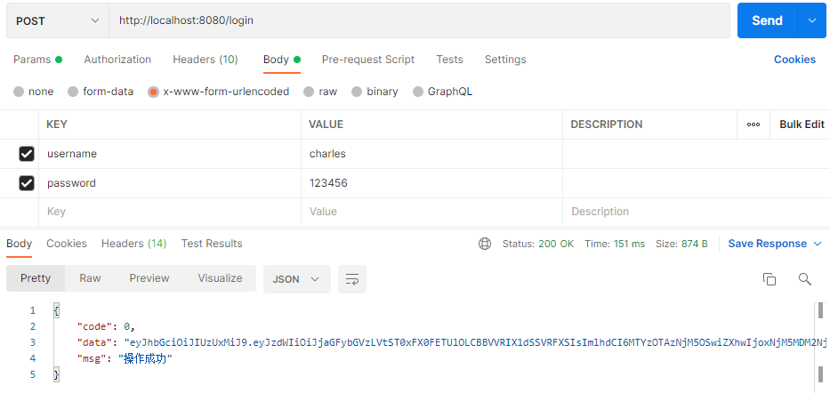
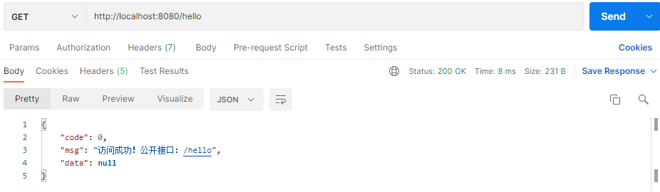
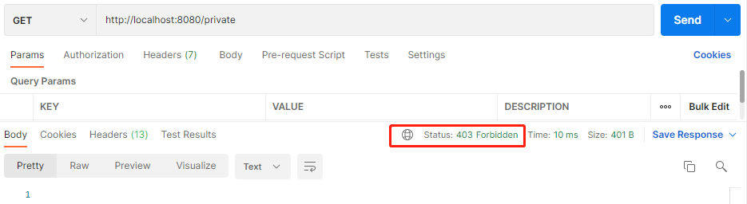
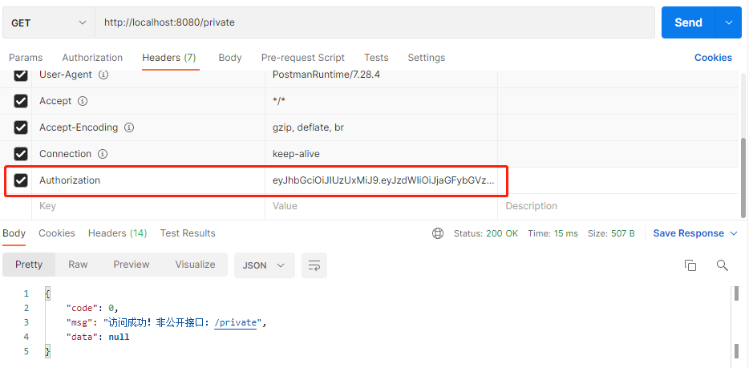

# Spring Security JWT

#### Spring Security 整合 JWT 实现无状态登录示例

### 1. 依赖与配置文件
1. 在 `pom.xml` 中引入依赖：

```xml
<dependency>
    <groupId>org.springframework.boot</groupId>
    <artifactId>spring-boot-starter-security</artifactId>
</dependency>
<dependency>
    <groupId>org.springframework.boot</groupId>
    <artifactId>spring-boot-starter-web</artifactId>
</dependency>
<dependency>
    <groupId>org.mybatis.spring.boot</groupId>
    <artifactId>mybatis-spring-boot-starter</artifactId>
    <version>2.2.0</version>
</dependency>
<dependency>
    <groupId>mysql</groupId>
    <artifactId>mysql-connector-java</artifactId>
    <scope>runtime</scope>
</dependency>
<dependency>
    <groupId>org.projectlombok</groupId>
    <artifactId>lombok</artifactId>
    <optional>true</optional>
</dependency>
<dependency>
    <groupId>io.jsonwebtoken</groupId>
    <artifactId>jjwt</artifactId>
    <version>0.9.1</version>
</dependency>
<dependency>
    <groupId>com.alibaba</groupId>
    <artifactId>fastjson</artifactId>
    <version>1.2.78</version>
</dependency>
```

2. 用户信息从数据库中获取，在 `application.yml` 配置文件中配置：

```ymal
server:
  port: 8080

spring:
  datasource:
    url: jdbc:mysql://192.168.2.100:3306/security?characterEncoding=UTF8&serverTimezone=Asia/Shanghai
    username: developer
    password: 05bZ/OxTB:X+yd%1

mybatis:
  mapper-locations: classpath:mapper/*.xml
```

### 2. 自定义Security策略
#### 2.1 通过继承 WebSecurityConfigurerAdapter 实现自定义Security策略
```java
/**
 * 1. 通过继承 WebSecurityConfigurerAdapter 实现自定义Security策略
 * @Configuration：声明当前类是一个配置类
 * @EnableWebSecurity：开启WebSecurity模式
 * @EnableGlobalMethodSecurity(securedEnabled=true)：开启注解，支持方法级别的权限控制
 */
@Configuration
@EnableWebSecurity
@EnableGlobalMethodSecurity(securedEnabled = true)
public class SecurityConfig extends WebSecurityConfigurerAdapter {

    @Resource
    private UserDetailsService userDetailsService;

    @Resource
    private BCryptPasswordEncoder bCryptPasswordEncoder;

    /**
     * 全局请求忽略规则配置
     */
    @Override
    public void configure(WebSecurity web) {
        // 需要放行的URL
        web.ignoring().antMatchers("/register", "/hello");
    }

    /**
     * 自定义认证策略：登录的时候会进入
     */
    @Override
    public void configure(AuthenticationManagerBuilder auth) {
        // 2.通过实现 AuthenticationProvider 自定义身份认证验证组件
        auth.authenticationProvider(new AuthenticationProviderImpl(userDetailsService, bCryptPasswordEncoder));
    }

    /**
     * HTTP 验证规则
     */
    @Override
    protected void configure(HttpSecurity http) throws Exception {
        http
            // 关闭Session
            .sessionManagement().sessionCreationPolicy(SessionCreationPolicy.STATELESS)
            // 所有请求需要身份认证
            .and().authorizeRequests().anyRequest().authenticated()
            .and()
            // 3.自定义JWT登录过滤器
            .addFilter(new JwtLoginFilter(authenticationManager()))
            // 4.自定义JWT认证过滤器
            .addFilter(new JwtAuthenticationFilter(authenticationManager()))
            // 5.自定义认证拦截器，也可以直接使用内置实现类Http403ForbiddenEntryPoint
            .exceptionHandling().authenticationEntryPoint(new AuthenticationEntryPointImpl())
            // 允许跨域
            .and().cors()
            // 禁用跨站伪造
            .and().csrf().disable();
    }
}
```

#### 2.2 通过实现 AuthenticationProvider 自定义身份认证验证组件
```java
@Slf4j
public class AuthenticationProviderImpl implements AuthenticationProvider {

    private final UserDetailsService userDetailsService;
    private final BCryptPasswordEncoder bCryptPasswordEncoder;

    public AuthenticationProviderImpl(UserDetailsService userDetailsService, BCryptPasswordEncoder bCryptPasswordEncoder){
        this.userDetailsService = userDetailsService;
        this.bCryptPasswordEncoder = bCryptPasswordEncoder;
    }

    /**
     * 用来验证用户身份 （对传递的Authentication对象的身份验证）
     *
     * @param authentication 传递的Authentication对象
     * @return 包含凭证的经过完全认证的对象
     * @throws AuthenticationException 份验证失败异常
     */
    @Override
    public Authentication authenticate(Authentication authentication) throws AuthenticationException {
        // 获取认证的用户名 & 密码
        String name = authentication.getName();
        String password = authentication.getCredentials().toString();
        // 认证逻辑
        UserDetails userDetails = userDetailsService.loadUserByUsername(name);
        if (bCryptPasswordEncoder.matches(password, userDetails.getPassword())) {
            log.info("用户登录成功，username={}", name);
            // 这里设置权限和角色
            ArrayList<GrantedAuthority> authorities = new ArrayList<>();
            authorities.add( new GrantedAuthorityImpl("ROLE_ADMIN"));
            authorities.add( new GrantedAuthorityImpl("AUTH_WRITE"));
            // 生成令牌 这里令牌里面存入了:name,password,authorities, 当然你也可以放其他内容
            return new UsernamePasswordAuthenticationToken(name, password, authorities);
        } else {
            throw new BadCredentialsException("密码错误");
        }
    }

    /**
     * 判断当前的AuthenticationProvider 是否支持对应的Authentication对象
     * @param authentication Authentication对象
     * @return boolean
     */
    @Override
    public boolean supports(Class<?> authentication) {
        return authentication.equals(UsernamePasswordAuthenticationToken.class);
    }
}
```

`BCryptPasswordEncoder` 解析器注入到容器
```java
@Configuration
public class WebConfig {
    @Bean
    public BCryptPasswordEncoder bCryptPasswordEncoder() {
        return new BCryptPasswordEncoder();
    }
}
```

实现 `UserDetailsService` 接口，自定义逻辑
```java
@Service
public class UserDetailsServiceImpl implements UserDetailsService {
    @Resource
    private SysUserDao sysUserDao;
    @Override
    public UserDetails loadUserByUsername(String username) throws UsernameNotFoundException {
        // 数据库中查找用户
        SysUser user = sysUserDao.findByUsername(username);
        if(user == null){
            throw new UsernameNotFoundException("用户" + username + "不存在!");
        }
        return new User(user.getUsername(), user.getPassword(), emptyList());
    }
}
```

实现 `GrantedAuthority` 存储权限和角色
```java
/**
 * 权限类型，负责存储权限和角色
 */
public class GrantedAuthorityImpl implements GrantedAuthority {
    private String authority;
    public GrantedAuthorityImpl(String authority) {
        this.authority = authority;
    }
    public void setAuthority(String authority) {
        this.authority = authority;
    }
    @Override
    public String getAuthority() {
        return this.authority;
    }
}
```

#### 2.3 自定义JWT登录过滤器，继承 UsernamePasswordAuthenticationFilter
重写了其中的3个方法
- `attemptAuthentication`：接收并解析用户凭证。
- `successfulAuthentication`：用户成功登录后被调用，我们在这个方法里生成token。
- `unsuccessfulAuthentication`：认证失败后被调用

```java
@Slf4j
public class JwtLoginFilter extends UsernamePasswordAuthenticationFilter {

    private final AuthenticationManager authenticationManager;

    public JwtLoginFilter(AuthenticationManager authenticationManager) {
        this.authenticationManager = authenticationManager;
    }

    /**
     * 尝试身份认证(接收并解析用户凭证)
     */
    @Override
    public Authentication attemptAuthentication(HttpServletRequest request, HttpServletResponse response) throws AuthenticationException {
        String username = request.getParameter("username");
        String password = request.getParameter("password");
        return authenticationManager.authenticate(
                new UsernamePasswordAuthenticationToken(username, password, new ArrayList<>())
        );
    }

    /**
     * 认证成功(用户成功登录后，这个方法会被调用，我们在这个方法里生成token)
     */
    @Override
    protected void successfulAuthentication(HttpServletRequest request, HttpServletResponse response, FilterChain chain, Authentication auth) {
        try {
            Collection<? extends GrantedAuthority> authorities = auth.getAuthorities();
            // 定义存放角色集合的对象
            List<String> roleList = new ArrayList<>();
            for (GrantedAuthority grantedAuthority : authorities) {
                roleList.add(grantedAuthority.getAuthority());
            }
            /*
             * 生成token
             */
            Calendar calendar = Calendar.getInstance();
            // 设置签发时间
            calendar.setTime(new Date());
            Date now = calendar.getTime();
            // 设置过期时间: 5分钟
            calendar.add(Calendar.MINUTE, 5);
            Date time = calendar.getTime();
            String token = Jwts.builder()
                    .setSubject(auth.getName() + "-" + roleList)
                    // 签发时间
                    .setIssuedAt(now)
                    // 过期时间
                    .setExpiration(time)
                    // 自定义算法与签名：这里算法采用HS512，常量中定义签名key
                    .signWith(SignatureAlgorithm.HS512, ConstantKey.SIGNING_KEY)
                    .compact();
            /*
             * 返回token
             */
            log.info("用户登录成功，生成token={}", token);
            // 登录成功后，返回token到header里面
            response.addHeader("Authorization", token);
            // 登录成功后，返回token到body里面
            ResponseJson<String> result = ResponseJson.success(token);
            response.setCharacterEncoding("UTF-8");
            response.getWriter().write(JSON.toJSONString(result));
        } catch (IOException e) {
            log.error("IOException:", e);
        }
    }

    /**
     * 认证失败调用
     */
    @Override
    protected void unsuccessfulAuthentication(HttpServletRequest request, HttpServletResponse response, AuthenticationException exception) throws IOException {
        log.warn("登录失败[{}]，AuthenticationException={}", request.getRequestURI(), exception.getMessage());
        // 登录失败，返回错误信息
        ResponseJson<Void> result = ResponseJson.error(exception.getMessage(), null);
        response.setCharacterEncoding("UTF-8");
        response.getWriter().write(JSON.toJSONString(result));
    }
}
```

自定义加密的签名`key`
```java
/**
 * 自定义签名key常量
 */
public class ConstantKey {
    public static final String SIGNING_KEY = "Charles@Jwt!&Secret^#";
}
```

自定义全局API返回JSON数据对象
```java
@Data
public class ResponseJson<T> implements Serializable {
    /** 自定义状态码 */
    private int code;
    /** 提示信息 */
    private String msg;
    /** 返回数据 */
    private T data;

    private ResponseJson(int code, String msg, T data) {
        this.code = code;
        this.msg = msg;
        this.data = data;
    }

    public static ResponseJson<Void> success() {
        return new ResponseJson<>(0, "操作成功", null);
    }
    public static<T> ResponseJson<T> success(T data) {
        return new ResponseJson<>(0, "操作成功", data);
    }
    public static<T> ResponseJson<T> success(String msg, T data) {
        return new ResponseJson<>(0, msg, data);
    }
    public static<T> ResponseJson<T> success(int code, String msg, T data) {
        return new ResponseJson<>(code, msg, data);
    }

    public static ResponseJson<Void> error() {
        return new ResponseJson<>(-1, "操作失败", null);
    }
    public static ResponseJson<Void> error(String msg) {
        return new ResponseJson<>(-1, msg, null);
    }
    public static ResponseJson<Void> error(int code, String msg) {
        return new ResponseJson<>(code, msg, null);
    }
    public static<T> ResponseJson<T> error(String msg, T data) {
        return new ResponseJson<>(-1, msg, data);
    }
    public static<T> ResponseJson<T> error(int code, String msg, T data) {
        return new ResponseJson<>(code, msg, data);
    }

    @Override
    public String toString() {
        return "ResponseJson{" + "code=" + code + ", msg='" + msg + '\'' + ", data=" + data + '}';
    }
    private static final long serialVersionUID = 1L;
}
```


#### 2.4 自定义JWT认证过滤器，继承 BasicAuthenticationFilter，重写doFilterInternal方法
从http头的Authorization 项读取token数据，然后用Jwts包提供的方法校验token的合法性。如果校验通过，就认为这是一个取得授权的合法请求。

```java
@Slf4j
public class JwtAuthenticationFilter extends BasicAuthenticationFilter {

    public JwtAuthenticationFilter(AuthenticationManager authenticationManager) {
        super(authenticationManager);
    }

    @Override
    protected void doFilterInternal(HttpServletRequest request, HttpServletResponse response, FilterChain chain) throws IOException, ServletException {
        UsernamePasswordAuthenticationToken authentication = getAuthentication(request, response);
        SecurityContextHolder.getContext().setAuthentication(authentication);
        chain.doFilter(request, response);
    }

    private UsernamePasswordAuthenticationToken getAuthentication(HttpServletRequest request, HttpServletResponse response) {
        /*
         * 解析token
         */
        String token = request.getHeader("Authorization");
        if (!ObjectUtils.isEmpty(token)) {
            try {
                Claims claims = Jwts.parser()
                        // 设置生成token的签名key
                        .setSigningKey(ConstantKey.SIGNING_KEY)
                        // 解析token
                        .parseClaimsJws(token).getBody();
                String user = claims.getSubject();
                if (user != null) {
                    String[] split = user.split("-")[1].split(",");
                    ArrayList<GrantedAuthority> authorities = new ArrayList<>();
                    for (String s : split) {
                        authorities.add(new GrantedAuthorityImpl(s));
                    }
                    // 刷新Token
                    refreshToken(response, claims);
                    // 返回Authentication
                    return new UsernamePasswordAuthenticationToken(user, null, authorities);
                }
            } catch (ExpiredJwtException e) {
                log.warn("访问[{}]失败，ExpiredJwtException={}", request.getRequestURI(), e.getMessage());
            } catch (UnsupportedJwtException e) {
                log.warn("访问[{}]失败，UnsupportedJwtException={}", request.getRequestURI(), e.getMessage());
            } catch (MalformedJwtException e) {
                log.warn("访问[{}]失败，MalformedJwtException={}", request.getRequestURI(), e.getMessage());
            } catch (SignatureException e) {
                log.warn("访问[{}]失败，SignatureException={}", request.getRequestURI(), e.getMessage());
            } catch (IllegalArgumentException e) {
                log.warn("访问[{}]失败，IllegalArgumentException={}", request.getRequestURI(), e.getMessage());
            }
        }
        log.warn("访问[{}]失败，需要身份认证", request.getRequestURI());
        return null;
    }

    /**
     * 刷新Token
     * 刷新Token的时机：
     * 1. 当前时间 < token过期时间
     * 2. 当前时间 > (签发时间 + (token过期时间 - token签发时间)/2)
     */
    private void refreshToken(HttpServletResponse response, Claims claims) {
        // 当前时间
        long current = System.currentTimeMillis();
        // token签发时间
        long issuedAt = claims.getIssuedAt().getTime();
        // token过期时间
        long expiration = claims.getExpiration().getTime();
        // (当前时间 < token过期时间) && (当前时间 > (签发时间 + (token过期时间 - token签发时间)/2))
        if ((current < expiration) && (current > (issuedAt + ((expiration - issuedAt) / 2)))) {
            /*
             * 重新生成token
             */
            Calendar calendar = Calendar.getInstance();
            // 设置签发时间
            calendar.setTime(new Date());
            Date now = calendar.getTime();
            // 设置过期时间: 5分钟
            calendar.add(Calendar.MINUTE, 5);
            Date time = calendar.getTime();
            String refreshToken = Jwts.builder()
                    .setSubject(claims.getSubject())
                    // 签发时间
                    .setIssuedAt(now)
                    // 过期时间
                    .setExpiration(time)
                    // 算法与签名(同生成token)：这里算法采用HS512，常量中定义签名key
                    .signWith(SignatureAlgorithm.HS512, ConstantKey.SIGNING_KEY)
                    .compact();
            // 主动刷新token，并返回给前端
            response.addHeader("refreshToken", refreshToken);
            log.info("刷新token执行时间: {}", (System.currentTimeMillis() - current) + " 毫秒");
        }
    }
}
```

#### 2.5 通过实现 `AuthenticationEntryPoint` 自定义认证拦截器
```java
@Slf4j
public class AuthenticationEntryPointImpl implements AuthenticationEntryPoint {
    public AuthenticationEntryPointImpl() {}
    /**
     * @param request 遇到了认证异常authException用户请求
     * @param response 将要返回给客户的相应
     */
    @Override
    public void commence(HttpServletRequest request, HttpServletResponse response, AuthenticationException exception) throws IOException {
        log.debug("预认证入口被调用。拒绝访问，AuthenticationException={}", exception.getMessage());
        // 没有权限，返回403
        response.sendError(403, "Access Denied");
    }
}
```


### 3. 示例DEMO
sql
```sql
DROP TABLE IF EXISTS `sys_user`;
CREATE TABLE `sys_user` (
  `id` bigint NOT NULL AUTO_INCREMENT,
  `username` varchar(255) DEFAULT NULL COMMENT '用户名',
  `password` varchar(255) DEFAULT NULL COMMENT '密码',
  PRIMARY KEY (`id`)
) ENGINE=InnoDB DEFAULT CHARSET=utf8 COMMENT='系统用户表';
```
Java代码
```java
/**
 * 接口
 */
@RestController
public class SysUserApi {
    @Resource
    private SysUserService sysUserService;
    @PostMapping("/register")
    public ResponseJson<SysUser> register(SysUser sysUser) {
        return sysUserService.register(sysUser);
    }
    @GetMapping("/hello")
    public ResponseJson<Void> hello() {
        return ResponseJson.success("访问成功！公开接口：/hello",null);
    }
    @GetMapping("/private")
    public ResponseJson<Void> hello2() {
        return ResponseJson.success("访问成功！非公开接口：/private", null);
    }
}
/**
 * 用户实体类
 */
@Data
public class SysUser {
    private Long id;
    private String username;
    private String password;
}
/**
 * 服务层
 */
@Service
public class SysUserService {
    @Resource
    private SysUserDao sysUserDao;
    @Resource
    private BCryptPasswordEncoder passwordEncoder;
    public ResponseJson<SysUser> register(SysUser sysUser) {
        if (StringUtils.isEmpty(sysUser.getUsername()) || StringUtils.isEmpty(sysUser.getPassword())){
            return ResponseJson.error("用户名或密码不能为空", null);
        }
        String encodePassword = passwordEncoder.encode(sysUser.getPassword());
        sysUser.setPassword(encodePassword);
        sysUserDao.insertSysUser(sysUser);
        return ResponseJson.success("注册成功", sysUser);
    }
}
/**
 * DAO层
 */
@Mapper
public interface SysUserDao {
    SysUser findByUsername(String username);
    void insertSysUser(SysUser sysUser);
}
```
```xml
<insert id="insertSysUser" keyProperty="id" keyColumn="id" useGeneratedKeys="true">
INSERT INTO sys_user(username, password) VALUES(#{username}, #{password})
</insert>
<select id="findByUsername" resultType="com.example.jwt.entity.SysUser">
SELECT id,username,PASSWORD FROM sys_user WHERE username=#{username}
</select>
```


### 4. 测试
注册一个用户：


登录：


访问公开接口：


访问需要认证的接口，无权限返回403：


访问需要认证的接口，通过有效Token访问：


